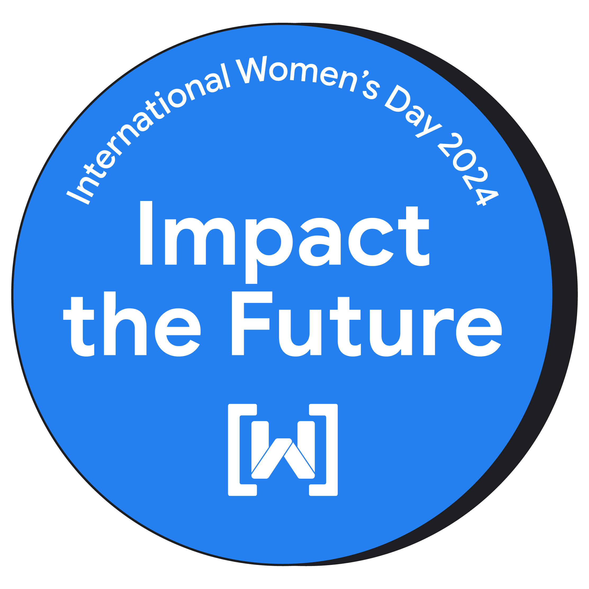

 

# Women's Techmakers 2024 

Bienvenidas al evento anual de Women's Techmakers, una asociación impulsada por un colectivo de mujeres comprometidas con la misión de aumentar la presencia femenina en el sector tecnológico. A través de iniciativas como esta, buscamos fomentar la participación activa de las mujeres en la tecnología y convertirnos en referentes e inspiración para las generaciones más jóvenes.

 

## Objetivos

1. **Fomentar Relaciones:** Crear un espacio propicio para fortalecer las relaciones entre mujeres que comparten un interés común en el ámbito tecnológico.

2. **Visibilizar y Dar Voz:** Destacar y compartir las experiencias de las profesionales de la tecnología, ofreciendo una plataforma para que sus voces sean escuchadas.

3. **Formación Tecnológica:** Impartir talleres destinados a niñas y niños, brindándoles oportunidades para explorar y aprender sobre temas tecnológicos desde una edad temprana.

4. **Promover Referentes:** Inspirar a las más jóvenes al proporcionar modelos a seguir, mostrándoles que están más que capacitadas para triunfar en el sector tecnológico.

5. **Crear un Ambiente Seguro:** Organizar un evento acogedor donde todas nos sintamos cómodas y seguras para compartir, aprender y crecer juntas.

 

## Tema: Impactar el Futuro

El lema de nuestro evento es "Impactar el Futuro". Todas tenemos el poder y la responsabilidad de influir en el futuro de la tecnología y la sociedad. La inteligencia artificial (IA) desempeña un papel crucial en la formación de nuestro mundo, y nos preguntamos: ¿cómo será ese futuro y cómo lo construiremos?

Podemos utilizar nuestras habilidades, creatividad y pasión para generar un cambio positivo y abordar los problemas que nos importan a nosotras y nuestras comunidades. Además, tenemos la capacidad de inspirar a la próxima generación de mujeres en tecnología, quienes continuarán impactando el futuro con sus propias ideas e innovaciones.

Únete a nosotros en este evento, donde celebraremos la diversidad, la innovación y el potencial ilimitado de las mujeres en la tecnología. ¡Juntas, estamos cambiando el juego y construyendo un futuro tecnológico más inclusivo y brillante!

 

**Fecha:** Aún por determinar  
**Ubicación:** Aún por determinar  

¡Esperamos verte allí y juntas impactar el futuro! ✨👩‍💻 #WomenInTech #TechmakersEvent

  

